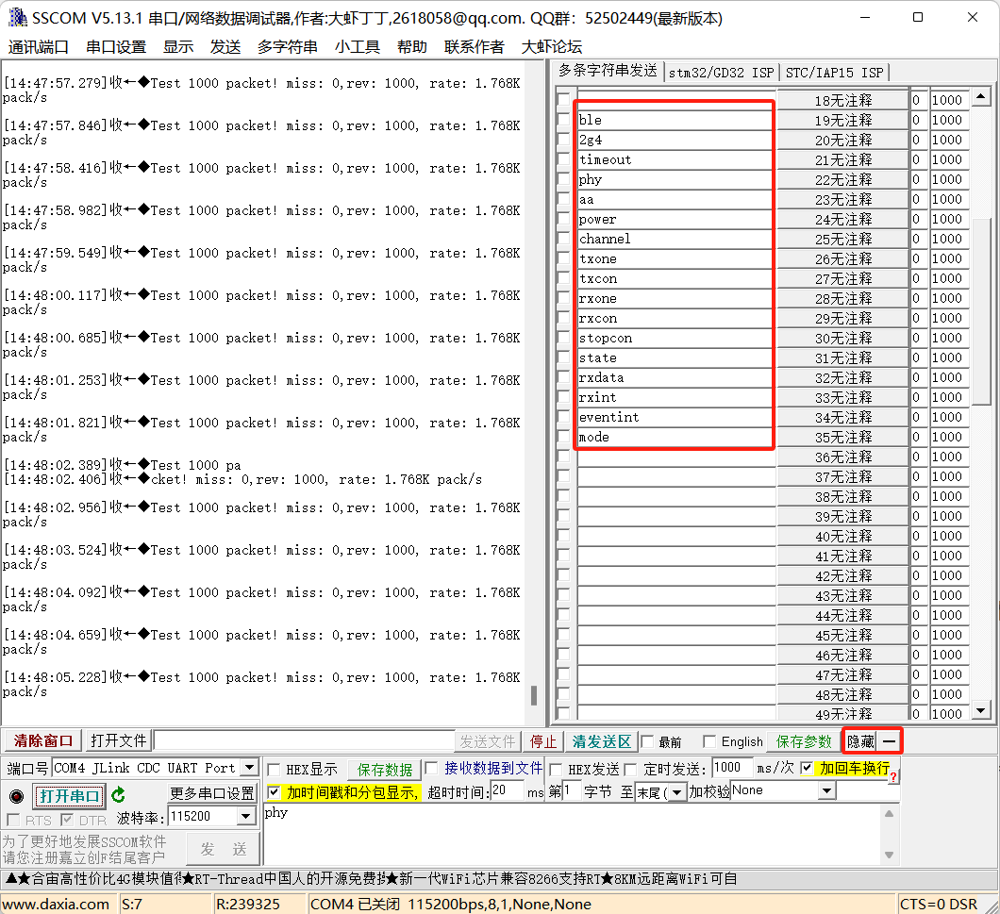

# 一 接口介绍

自V1.1.0以后，例程提供基于UART的控制接口。

开发者可以通过发送串口（UART0，115200）指令，控制设备的模式切换，配置2.4G的参数，进行2.4G的发送和接收等。

每条完整的指令末尾要加上**换行符**。

目前支持的所有指令如下：

| 串口指令 | 接口                   | 说明                                                         |
| -------- | ---------------------- | ------------------------------------------------------------ |
| h        | cmd_help               | 帮助指令，可以查看所有串口指令                               |
| ?        | cmd_help               | 帮助指令，可以查看所有串口指令                               |
| ble      | cmd_switch_to_ble      | 切换到BLE模式                                                |
| 2g4      | cmd_switch_to_2g4      | 切换到2.4G模式                                               |
| state    | cmd_get_2g4_state      | 查看当前的2.4G工作状态，包括三种：ING2P4G_STATE_IDLE，ING2P4G_STATE_TX，ING2P4G_STATE_RX |
| phy      | cmd_phy_set            | 设置2.4G的phy                                                |
| aa       | cmd_access_address_set | 设置2.4G的access address                                     |
| power    | cmd_power_set          | 设置2.4G的发射功率                                           |
| channel  | cmd_channel_set        | 设置2.4G的工作频道                                           |
| timeout  | cmd_rx_timeout_set     | 设置2.4G接收状态下的超时时间                                 |
| txone    | cmd_tx_one_packet      | 在2.4G模式下发送一包数据                                     |
| txcon    | cmd_tx_continus        | 在2.4G模式下连续发送数据                                     |
| rxone    | cmd_rx_one_packet      | 在2.4G模式下接收一包数据                                     |
| rxcon    | cmd_rx_continus        | 在2.4G模式下连续接收数据                                     |
| stopcon  | cmd_stop_continus      | 结束连续发送/接收                                            |
| rxdata   | cmd_rx_data_get        | 获取SLAVE上一包收到的数据                                    |
| test1    | cmd_test_inst1         | 通用测试指令1                                                |
| test2    | cmd_test_inst2         | 通用测试指令2                                                |
| shutdown | cmd_shutdown           | 设备进入低功耗模式（只能通过配置好的IO唤醒）                 |

# 二 使用说明

### 1 函数返回状态

大部分指令都不是必然配置成功的，和设备当前的状态有关，可以通过返回值判断执行的结果。

比如在BLE模式下使用**channel**指令就会返回**ING2P4G_MODE_ERROR**，表明当前的模式（BLE/2.4g）不支持此指令。

所有的返回状态如下：

```
typedef enum
{
    ING2P4G_SUCCESS,            /* <=> Operate success. */
    ING2P4G_MODE_ERROR,         /* <=> It is not in 2.4G/BLE mode. */
    ING2P4G_CRC_ERROR,          /* <=> Received crc value error. */
    ING2P4G_ERROR_TIMEOUT,      /* <=> TX/RX timeout. */
    ING2P4G_ERROR_TX_GOING,     /* <=> TX procedure is going. */
    ING2P4G_ERROR_RX_GOING,     /* <=> RX procedure is going */
    ING2P4G_PARAM_ERROR,        /* <=> Input parameters out of range */
} ing2p4g_status_t;
```

只有返回**ING2P4G_SUCCESS**才表明配置成功，否则保持之前配置。

### 2 2.4G默认状态

当前demo每次从BLE切换到2.4G模式，都会恢复2.4G的默认状态，不会保持上次2.4G模式下进行的配置。

默认状态如下：

```
    ing_2p4g_config.Mode          = MODE_MASTER;
    ing_2p4g_config.AccAddr       = 0x1234567A;
    ing_2p4g_config.PHY           = LLE_PHY_1M;
    ing_2p4g_config.Channel       = 2400;
    ing_2p4g_config.TXPOW         = 63;
    ing_2p4g_config.WhiteEn       = 0x1;
    ing_2p4g_config.WhiteIdx      = 0x0;
    ing_2p4g_config.CRCInit       = 0x123456;
    ing_2p4g_config.TimeOut       = 10000;//6.25s
    ing_2p4g_config.RxPktIntEn    = 0;
```

### 3 连续发送/接收

现在提供的指令包括单包发送/接收和连续发送/接收。

连续发送/接收可用于测试当前接口的吞吐能力。

如果在连接发送/接收状态下，再次发送连续发送/接收的指令，会停止连续发送/接收。

连续发送和接收当前是在应用层控制（通过**TEST_2P4G.c**里的**continus_2g4**变量），客户可以根据需要调整控制逻辑。

### 4 测试技巧

可以使用SSCOM（一款电脑端的串口收发工具）的**扩展**功能定义好常用的指令，方便进行测试。



### 5 指令传参

现在的模式里，所有指令都没有通过串口传递参数，都是在接口的内部进行参数控制。

比如**channel**的配置，目前是通过**2380**的起始数值，每配置一次递增**5**的方式。

之所以没有用串口传递参数，是因为串口输入的值为ASCII码，需要进行一定复杂度的转换才能用于实际参数的配置。

但是当前所有的指令都提供了配置参数的途径（接口的传入参数***param**），开发者可以根据自己的需求开发更便利的串口配置方式。