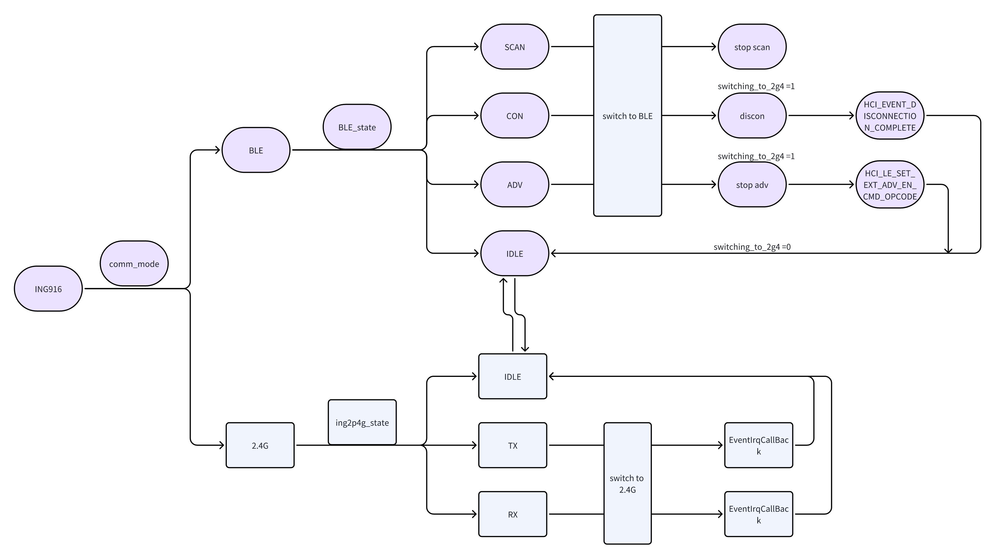

# 一 基本说明

本demo通过调用`BLE_2P4G_Switch.lib`，可以在ING_SDK基础上，开发支持标准BLE与ing2.4g两种无线协议的项目。

基于ING_SDK8.4.1及以上，使用extension版本协议栈。

### 1 所需文件

```
BLE_2P4G_Switch.lib
BLE_2p4g_Switch.h
ing_2p4g.h
```

### 2 mode和state

设备存在两种mode， `MODE_BLE`和`MODE_2G4`，对应BLE和ing2.4g两种工作协议。

在`MODE_BLE`下，存在4种state：`BLE_STATE_IDLE`，`BLE_STATE_ADV`，`BLE_STATE_CON`和`BLE_STATE_SCAN`。

在`MODE_2G4`，存在3中state：`ING2P4G_STATE_IDLE`，`ING2P4G_STATE_TX`和`ING2P4G_STATE_RX`。



### 3 ing2.4g的两种角色

对应ing2.4g的TX和RX两种动作，存在Master和Slave两种角色。

只有Master才能发送（TX），只有Slave才能接受（RX），如果Slave想有数据返回给Master，可以通过ack的payload反馈。

Master和SLAVE的角色，是在设备初始化时配置的。

```
void ing_2p4g_config_init(void)
{
    #if DEF_MASTER
    ing2p4g_config.Mode          = MODE_MASTER;
    #else
    ing2p4g_config.Mode          = MODE_SLAVE;
    #endif
    ing2p4g_config.AccAddr       = 0x12345678;
    ing2p4g_config.PHY           = LLE_PHY_2M;
    ing2p4g_config.Channel       = 2400;
    ing2p4g_config.TXPOW         = 63;
    ing2p4g_config.WhiteEn       = 0x1;
    ing2p4g_config.WhiteIdx      = 0x0;
    ing2p4g_config.CRCInit       = 0x123456;
    ing2p4g_config.TimeOut       = 1600;//10000;//6.25s
    ing2p4g_config.RxPktIntEn    = 1;
    ing2p4g_config.RxPktIntThres = 1;
}
```

# 二 使用说明

### 1 BLE和ing2.4g双模式实现

在已实现好ble的工程中，首先添加`BLE_2P4G_Switch.lib`，并包含两个头文件`BLE_2p4g_Switch.h`，`ing_2p4g.h`。

相对于标准BLE工程，双模式demo在app_main和setup_profile增加了一些初始化工作及回调函数注册，具体参见demo。

### 2 mode切换

demo默认初始化为BLE mode，通过按键（GPIO10）进行模式切换。

无论从BLE切换为ing2.4G，还是反之，都要在各自的IDLE state才能进程切换，否则程序可能会报错死掉。

#### 1）BLE切换到ing2.4g

BLE工程通常不会处在IDLE状态，而是会在BLE_STATE_SCAN（扫描）、BLE_STATE_CON（连接）、BLE_STATE_ADV（广播）三种状态中的一种，因此需要先停止当前的扫描、连接或者广播动作，让工程回到idle状态再进行切换。

```
	BLE_state_type_t state_now = BLE_state_get();
    switching_to_2g4 = 1;
    if (state_now == BLE_STATE_ADV)
    	gap_set_ext_adv_enable(0, sizeof(adv_sets_en) / sizeof(adv_sets_en[0]), adv_sets_en);
    else if(state_now == BLE_STATE_CON)
    {
    	if (INVALIDE_HANDLE != con_handle)
        	gap_disconnect(con_handle);
     }
     else if(state_now == BLE_STATE_IDLE)
     {}
```

相对于标准BLE工程，需要额外通过`BLE_state_set`接口，在BLE状态变化时进行配置。

也可通过`BLE_state_get`接口来获取当前的BLE状态。

#### 2）ing2.4g切换到BLE

ing2.4g切换到BLE， 同样要注意，不能在`ING2P4G_STATE_TX`和`ING2P4G_STATE_RX`状态下进行切换，如果在这两种状态下进行切换，`switch_to_BLE`会返回错误状态。

可在切换前通过`ing_2p4g_get_state`获取当前状态。

### 3 中断回调注册

目前对于ing2.4g，提供了两种回调函数，分别是rx中断和event中断，可以通过`ing2p4g_set_irq_callback`进行回调注册。

rx中断发生在设备接收到数据后，event中断发生在一个通讯事件（event）完成后。

对于master来说，event中断和rx中断几乎同时发生，对于slave设备，event会比rx中断晚一些（中间有ack回复的时间）。

建议如无必要，只使用event中断。

### 4 数据交换

master和slave分别通过如下接口开启一个TX/RX事件，两个接口都提供了数据的输入参数。

对于TX来说，提供的是将要发送的数据长度和数据，对于RX来说，提供的是ack的payload的长度和数据。

```
uint8_t start_2p4g_TX(uint8_t len, uint8_t *data);
uint8_t start_2p4g_RX(uint8_t len, uint8_t *data);
```

在注册的中断回调中，如果成功接收到数据，可以通过如下接口获取：

```
uint8_t GetRxData(ING2P4G_RxPacket *rxpacket);
```

如果事件异常结束，此接口也会返回异常状态。

### 5 参数调整

提供了4个接口，可以实时调整ing2.4g通讯的各项参数，包括，tx_power，channel，access address和phy。

```
uint8_t ing_2p4g_set_phy(uint8_t phy);
uint8_t ing_2p4g_set_access_address(uint32_t  AccAddr);
uint8_t ing_2p4g_set_tx_power(uint8_t  tx_power);
uint8_t ing_2p4g_set_channel(uint16_t  channel);
```

需要注意的是，调整参数也要在`ING2P4G_STATE_IDLE`状态下才能成功执行，否则会返回错误状态。
